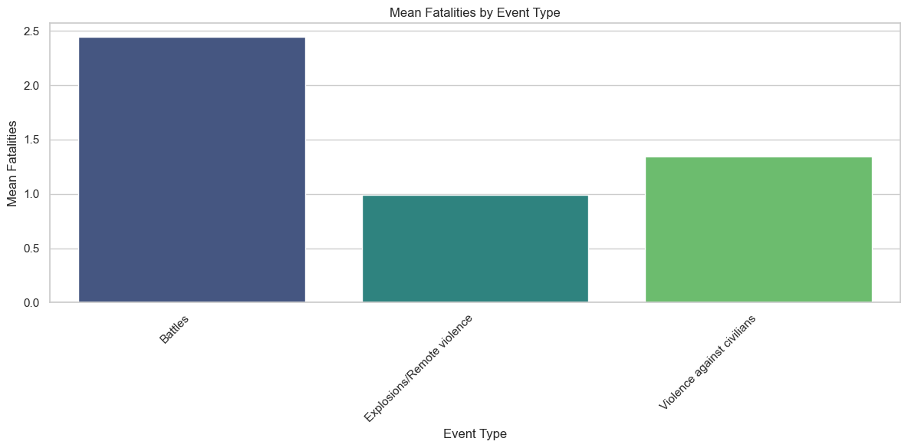

# Armed Conflicts Analytics

An applied data science project analysing global armed conflict events using clustering techniques and severity modelling. The project combines unsupervised learning with exploratory distributional analysis and presents the results in an interactive Streamlit dashboard.

# 

## Dataset Content
**Armed Conflict Location & Event Data Project (ACLED)**, a widely used, publicly available database that systematically records political violence and protest events around the world. ACLED collects event-level data through continuous monitoring of a broad range of sources, including international and local news outlets, reports from non-governmental organisations, and other publicly available information. Each event is manually coded by trained analysts following a standardised methodology.

The dataset contains detailed information on individual conflict events, including the date of occurrence, type of event, actors involved, interaction type, geographic region, and reported fatalities. Events span multiple forms of political violence, such as battles, violence against civilians, and remote explosive incidents, and cover a wide temporal and geographic scope.

Original dimensions: 
- 636 MB
- 1.065.312 Rows x 21 Columns

## Business Requirements
This project aimed to develop an unsupervised, data-driven understanding of organised armed conflict through spatial clustering, temporal mobility analysis, hotspot detection, and severity modelling. 

<ins>Objectives</ins>

1. Develop a spatial clustering methodology using DBSCAN to identify and characterise distinct conflict clusters.
2. Extract structural insights from the derived clusters by analysing various characteristics.
3. Model conflict severity through Pareto and related heavy-tail distributions to assess escalation potential.

## Hypotheses / Expectations
- H1: Conflict events will form coherent, distinct clusters extractable by a DBSCAN model.
- H2: Obtained clusters will exhibit consistent internal structural properties, such as characteristic event-type distributions, or fatality intensity profiles.
- H3: Fatality distributions will follow heavy-tailed (Pareto-like) behaviour.

## Project Plan

### Steps
1. **Data Acquisition**
Conflict event data were obtained from the Armed Conflict Location & Event Data Project (ACLED) through the official data access portal.
2. **Data Loading and Size Management**
Due to the large volume of event-level records, a memory-efficient data loading procedure was implemented, including explicit data type specification and selective column loading to reduce memory usage.
3. **Data Quality Assessment**
Initial checks were performed to identify missing values, inconsistent encodings, outliers, and potential artefacts related to geographic precision and fatality reporting.
4. **Exploratory Data Analysis (EDA)**
Exploratory analysis was conducted to understand temporal trends, geographic concentration of events, event type distributions, and the empirical distribution of reported fatalities.
5. **Data Cleaning and Feature Engineering**
Relevant variables were selected, categorical features were encoded, numerical variables were transformed and standardised where appropriate, and non-informative or redundant fields were removed.
6. **Clustering Methodology**
    - Parameter Selection: Density-based clustering parameters were selected using k-distance analysis on a representative data sample.
    - DBSCAN on Sample: DBSCAN was applied to a stratified subset of the data to identify core conflict clusters while managing computational constraints.
    - Cluster Assignment: A k-nearest neighbours (k-NN) approach was used to assign cluster labels to the remaining events based on proximity to clustered samples.
7. **Cluster Insight Extraction**
Identified clusters were analysed in terms of size, temporal activity, event composition, interaction types, and severity characteristics to derive interpretable conflict typologies.
8. **Severity Distribution Modelling**
Conflict severity was examined through distributional analysis of fatalities, including fitting and comparing power-law, lognormal, and exponential models using complementary cumulative distribution functions.
9. **Dashboard Development**
An interactive Streamlit dashboard was developed to present key findings, enabling users to explore conflict clusters, severity distributions, and temporal dynamics through filtered visualisations.

### Methodology choices
This project adopts an **exploratory, data-driven research methodology** appropriate for the analysis of large-scale, observational conflict data. The ACLED dataset is not generated through controlled experiments but through systematic reporting of real-world events, which makes hypothesis-free exploration and pattern discovery a suitable starting point. Rather than testing predefined causal relationships, the methodology focuses on identifying regularities, structures, and distributions that emerge naturally from the data.

An **unsupervised analytical approach** was chosen to accommodate the absence of ground-truth labels for conflict typologies or escalation patterns. This allows conflict events to be grouped based on shared characteristics without imposing externally defined categories, supporting the discovery of latent structures within complex and heterogeneous data.

### Future direction
Several extensions could further enhance the scope and depth of this project. Future work could incorporate **richer temporal modelling**, such as explicit change-point detection or early-warning indicators, to better capture shifts in conflict dynamics over time. 

Integrating **additional contextual variables** (e.g. socioeconomic indicators or political stability metrics) could also improve the interpretability of identified conflict clusters. From a methodological perspective, alternative unsupervised approaches or hybrid clustering strategies could be explored to assess the robustness of the identified structures. 

Finally, the dashboard could be extended with **event-level drill-downs or comparative regional views**, enabling more granular exploration while maintaining the current high-level analytical focus.

## Analysis techniques used
1. <ins>Descriptive Statistics and Visualisation</ins>
These were used as an initial analytical layer to summarise event frequencies, temporal trends, and severity distributions. Given the large size and heterogeneity of the dataset, these techniques are essential for understanding baseline properties of the data, identifying anomalies, and guiding subsequent methodological choices. Visual tools such as time series plots, bar charts, and distribution plots enable intuitive inspection of conflict dynamics and support transparent communication of findings.
- Limitations: Descriptive analysis cannot uncover latent structure or explain underlying mechanisms.
- Alternatives: Nonequivalent statistical summaries or automated profiling tools could be used, but would not replace the need for human-guided exploration.

2. <ins>Density-Based Spatial Clustering (DBSCAN)</ins>
DBSCAN was employed as the primary clustering method to identify groups of conflict events with similar characteristics without requiring predefined labels or a specified number of clusters. This makes it well suited to the dataset, which contains complex, unevenly distributed conflict patterns and likely includes noise and outliers. DBSCAN’s ability to identify clusters of arbitrary shape aligns well with the project’s goal of discovering emergent conflict typologies rather than imposing rigid classifications.
- Limitations: DBSCAN is sensitive to parameter selection and can be computationally expensive on large datasets. It may also struggle with clusters of varying density.
- Alternatives: Algorithms such as HDBSCAN or Gaussian Mixture Models could offer greater flexibility or probabilistic interpretations but introduce additional complexity.

3. <ins>k-Nearest Neighbours (k-NN) for Cluster Assignment</ins>
Due to computational constraints, DBSCAN was applied to a representative data sample rather than the full dataset. A k-nearest neighbours (k-NN) approach was then used to assign cluster labels to the remaining events based on proximity to clustered samples. This hybrid strategy preserves the structure identified by DBSCAN while enabling scalability to large datasets.
- Limitations: k-NN assumes local similarity and may propagate misclassifications if sample clusters are imperfect.
- Alternatives: Approximate nearest neighbour methods or batch clustering with distributed computing could be considered for full-scale clustering.

4. <ins>Pareto and Heavy-Tailed Distribution Fitting</ins>
Severity analysis was conducted by fitting and comparing heavy-tailed distributions to the empirical distribution of conflict fatalities. This approach is appropriate given the highly skewed nature of conflict severity, where most events cause few or no fatalities while a small number result in extreme outcomes. Modelling the tail behaviour supports the project’s objective of understanding risk concentration and the statistical nature of extreme violence.
- Limitations: Power-law behaviour is sensitive to threshold selection and may not hold across the entire distribution.
- Alternatives: Lognormal or exponential models provide useful benchmarks and were explicitly compared to assess relative fit.

## Dashboard Design

### Pages
1. The overview page provides high-level descriptive statistics and temporal summaries of conflict events.
2. The cluster insights page focuses on comparative analysis across conflict clusters, allowing users to explore differences in temporal activity and severity distributions.
3. The severity modelling page presents the results of heavy-tailed distribution fitting using more technical language and formal statistical representations. 
4. A conclusions page synthesises the main findings in accessible, non-technical terms for a broader audience.

### Levels of expertise
Scientific results are communicated at multiple levels of abstraction. Quantitative findings are supported by formal statistical plots and model outputs where appropriate, while accompanying annotations and narrative summaries translate these results into intuitive interpretations. This layered approach allows technically proficient users to engage with methodological detail, while enabling non-specialist users to grasp the substantive implications of the analysis. In particular, the separation between analytical pages and the final conclusions page ensures that technical rigor and interpretability are both preserved.

### Accessibility
Visual design choices were made with accessibility in mind, including explicit consideration of colour vision deficiencies. Colour palettes with high contrast and perceptual uniformity were used across figures, and visual distinctions were reinforced through line styles, ordering, and annotations rather than colour alone. This ensures that key patterns remain interpretable for users with common forms of colour blindness and improves overall readability.

### Why Streamlit?
Streamlit was selected as the dashboard framework due to its suitability for **rapid prototyping, reproducibility, and direct integration** with Python-based data science workflows through GitHub. 

Unlike business intelligence tools such as Tableau or Power BI, Streamlit allows analytical logic, data processing, and visualisation to coexist within a single, transparent codebase. This facilitates reproducibility, supports custom analytical workflows, and aligns naturally with the project’s exploratory and research-oriented goals. Additionally, Streamlit enables lightweight deployment and sharing without requiring proprietary software or complex infrastructure.

## Major challenges
* size challenge for pandas loading, ml modelling, streemlit, and git fuckup
ucking up git 

* Please mention unfixed bugs and why they were not fixed. This section should include shortcomings of the frameworks or technologies used. Although time can be a significant variable to consider, paucity of time and difficulty understanding implementation are not valid reasons to leave bugs unfixed.
* Did you recognise gaps in your knowledge, and how did you address them?
* If applicable, include evidence of feedback received (from peers or instructors) and how it improved your approach or understanding.

## Development Roadmap
* What challenges did you face, and what strategies were used to overcome these challenges?
* What new skills or tools do you plan to learn next based on your project experience? 

## Deployment
### Heroku

* The App live link is: https://YOUR_APP_NAME.herokuapp.com/ 
* Set the runtime.txt Python version to a [Heroku-20](https://devcenter.heroku.com/articles/python-support#supported-runtimes) stack currently supported version.
* The project was deployed to Heroku using the following steps.

1. Log in to Heroku and create an App
2. From the Deploy tab, select GitHub as the deployment method.
3. Select your repository name and click Search. Once it is found, click Connect.
4. Select the branch you want to deploy, then click Deploy Branch.
5. The deployment process should happen smoothly if all deployment files are fully functional. Click now the button Open App on the top of the page to access your App.
6. If the slug size is too large then add large files not required for the app to the .slugignore file.

## Main Data Analysis Libraries
* Here you should list the libraries you used in the project and provide an example(s) of how you used these libraries.

## Domain application
how can this project be used in the domain

## Ethical considerations
* Were there any data privacy, bias or fairness issues with the data?
* How did you overcome any legal or societal issues?

## Legal and Social implications

## Conclusions

## Credits 

* In this section, you need to reference where you got your content, media and extra help from. It is common practice to use code from other repositories and tutorials, however, it is important to be very specific about these sources to avoid plagiarism. 
* You can break the credits section up into Content and Media, depending on what you have included in your project. 

### Content 

- The text for the Home page was taken from Wikipedia Article A
- Instructions on how to implement form validation on the Sign-Up page was taken from [Specific YouTube Tutorial](https://www.youtube.com/)
- The icons in the footer were taken from [Font Awesome](https://fontawesome.com/)

### Media

- The photos used on the home and sign-up page are from This Open-Source site
- The images used for the gallery page were taken from this other open-source site

### Declared use of generative AI

## Acknowledgements (optional)
* Thank the people who provided support through this project.